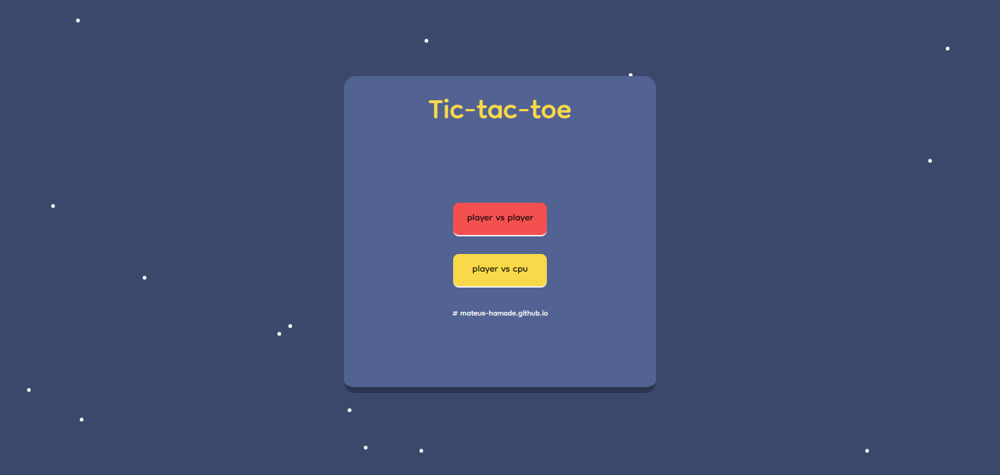
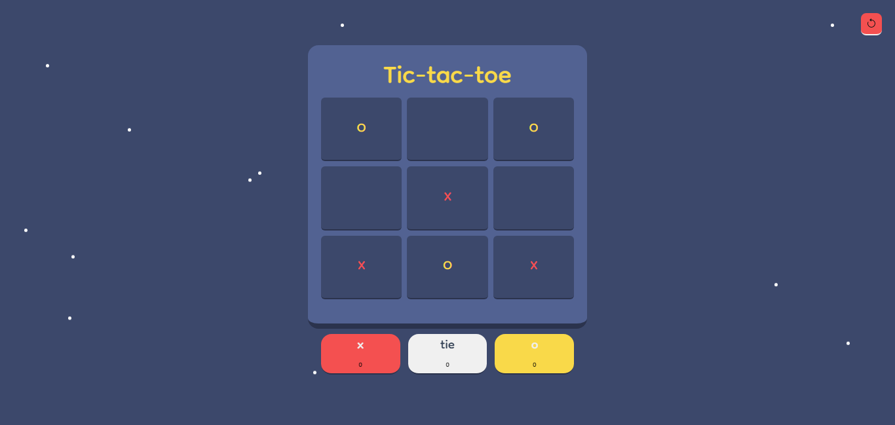

# Tic-tac-toe Javascript 🦏

### Projeto ⛏️
- O projeto em questão é um tic-tac-toe feito em javascript com o objetivo de aprender javascript vanilla.

### Ferramentas utilizadas 📚
- Html, css e javascript
- tailwindcss

### Executando o código

- Executando o código 🚀
```
>> npx tailwindcss -i ./src/style/input.css -o ./dist/output.css --watch
```

❗ Observação

- Se quiser modificar o código, será necessário executar o comando acima. Caso contrário, basta executar o live server.

### Imagens do projeto 📷




